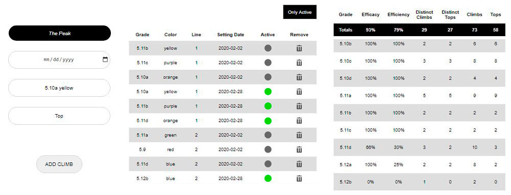

# Panic_Bear

## A climbing tracker website 

In sport climbing, tracking the **efficacy** has to do on whether or not a route was ascended from the ground to the top, with no falls and no additional help. But in order to better evaluate the climber's progress it's necessary to consider the **efficiency** too, which is how many attempts, or unsuccessful ascents, occurred in the process.

A climbing grade is a number intended to describe concisely the difficulty of climbing a determinate route. This website calculates the climber's efficacy and efficiency at the different grades he has climbed.  

After creating an account the user can register his climbs, access to his climbing record and see some statistics in order to understand his performance in the different difficulty levels he has tried on the walls. 

Gym managers can also create an account and upload the routes they have in their gyms (this allow the users to add these same routes to their climbing record). Gym managers can access to their routes history and see some statistics that could help them to better distribute and plan their routesetting.

## Implementation

This website uses a relational database managment system to organizes the data into four tables: `users`, `gyms`, `routes` and `climbs`.

Each table is composed of columns and rows. The rows represent instances or records of the table, and the columns represent values attributed to that instance. Each row in a table has its own unique primary key. These primary keys within the database are used to define the relationships among the tables. A foreign key is a field in a relational table that matches the primary key column of another table. It relates the two keys.

### Establishing the basis of interaction between tables

* `users` and `gyms` posses a **one to one** relation, meaning that each user can only register one gym, and each gym can only have one manager. For this, each record in the `gyms` table have an attribute to store a primary key of the `users` table as a foreign key.

* `users` and `climbs` posses a **one to many** relation, meaning that a user can register multiple climbs, but a climb can only belong to one user. For this, each record in the `climbs` table have an attribute to store a primary key of the `users` table as a foreign key.

* `gyms` and `routes` posses a **one to many** relation, meaning that a gym can register many routes, but a route can only belong to one gym. For this, each record in the `routes` table have an attribute to store a primary key of the `gyms` table as a foreign key.

* `climbs` and `routes` possess a **many to one** relation, meaning that each climb can only be done to one route, and a route can be climbed many times. For this, each record in the `climbs` table have an attribute to store a primary key of the `routes` table as a foreign key. 

### Generating the statistics

* The efficacy for a climbing grade is calculated by taking the number of distinct routes of the same grade with at least one successful attempt and dividing it by the number of distinct routes of this same grade with at least one successful or unsuccessful attempt.

* The efficiency for a climbing grade is calculated by taking the number of successful attemps to indistinct routes of the same grade and dividing it by the number of successful or unsuccessful attempts to indistinct routes of this same grade.

dt = mysqli_query($conn, "SELECT COUNT(DISTINCT climbs.routeId) FROM climbs LEFT JOIN routes ON routes.id = climbs.routeId WHERE climbs.userId = '$_COOKIE[userId]' AND routes.grade = '$x' AND climbs.status = 'Top'");

## Installation
At the root of this repository:

`cd push_swap` | Go to the compilation directory.

`make` | Compiles and creates two programs: `push_swap` and `checker`.

## Usage
`./push_swap [integers array]` | Prints the solution.

`./checker [integers array]` | Reads the solution from the standard input, and prints "OK" or "KO".

## Credits
[*Luis Sanchez*][linkedin] 2020

[linkedin]: https://www.linkedin.com/in/luis-sanchez-13bb3b189/

